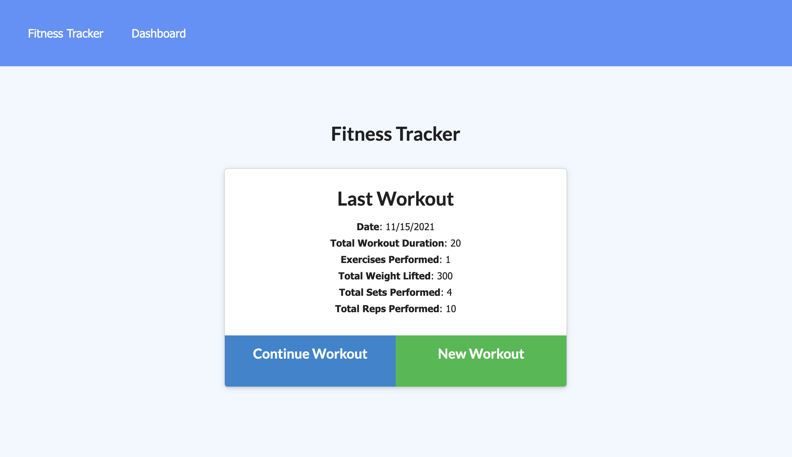
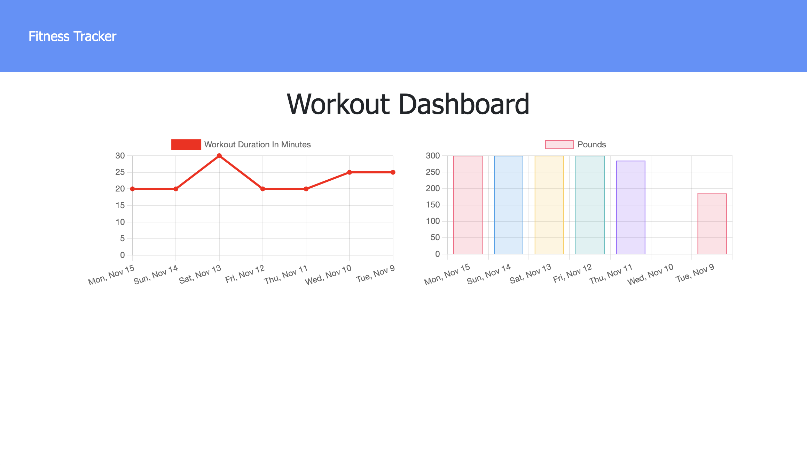

# Fitness Tracker

  

  ## Description
 This application allows users to track their workouts by entering in exercises as well as details about each exercise. This data is tracked so the user can reach their fitness goals.

 ## Mock Up

 

 ## Heroku Application

 [Click to view the deployed application](https://ltf-fitness-tracker.herokuapp.com/)

  ## Table of Contents 
  * [Installation](#installation)
  * [Usage](#usage)
  * [Questions](#questions)
  * [License](#license)
  
  ## Installation

  *Follow these steps to properly install this application:*

  There is no need to install anything to use this application.

  ## Usage

  **How to use this application:**

  From the front page of the application, select to add a new workout. You can then enter in invidivual exercises as well as details on the type, weight, sets, reps, and duration of each exercise. After saving this information, if you would like to add an additional exercise you can do so by clicking continue workout.

  ## License

  This repository has the MIT license. 
    For additional information, please view the [license description](https://opensource.org/licenses/MIT)
      

  ## Questions

  *For any additional questions or feedback about this application:*

  Feel free to reach out via email or contact me on Github:

  Email:
  [lindsaytfitz@gmail.com](mailto:lindsaytfitz@gmail.com)

  Github:
  [lindsfitz](https://github.com/lindsfitz)
